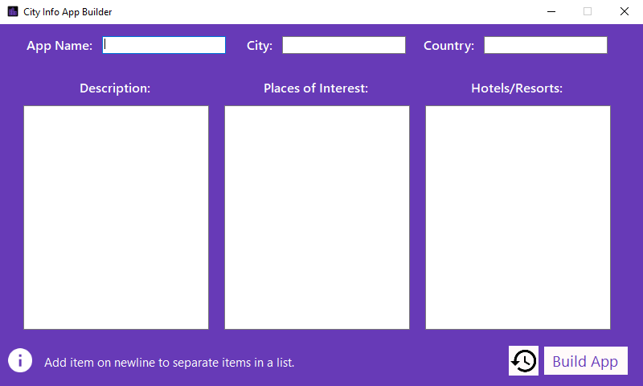
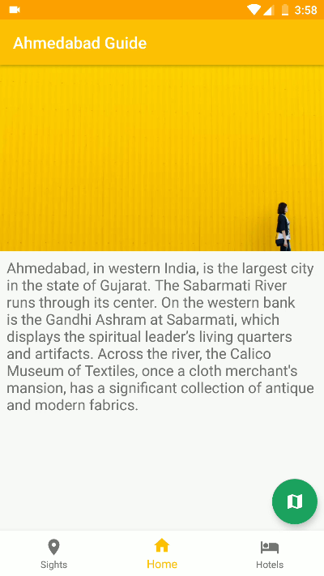
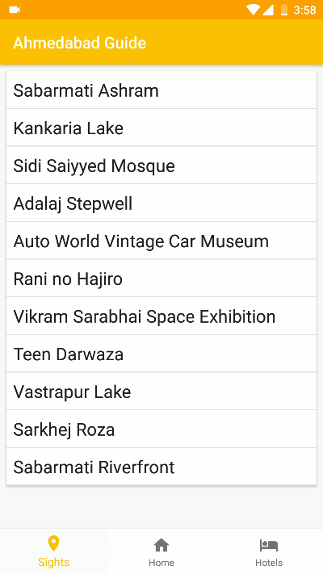
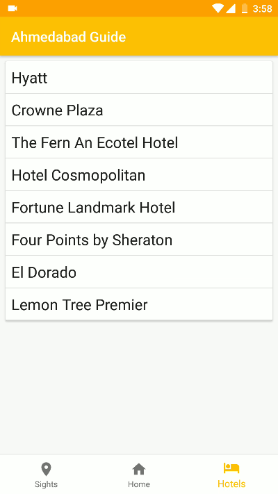

# City App Builder

University Project | Submitted: April **2018**

The "City Info App Builder" is a Windows based application which allows users to build an Android app with information about their city. The Windows application will output an Android APK which can be installed on Android smartphones.

User does not need to have any experience in programming to build an app using the "City Info App Builder". The user has to just enter data in the Windows application and click on the "Build App" button to generate an APK file.

## Screenshots

### App Builder

### City App

Clicking on any items will opem them in Google Maps.

## Links
[Download](https://github.com/itsarjunsinh/CityAppBuilder/releases) | Watch Demo: [App Builder](https://www.youtube.com/watch?v=NFdHpR-Kigk), [City App](https://www.youtube.com/watch?v=BMwa5J7gmOY)

The project report is available to students upon request.

## Credits

This project uses Apktool to repackage included custom made City Android app to add information provided by the user.

## License

This project is licensed under the [MIT License](LICENSE). 
